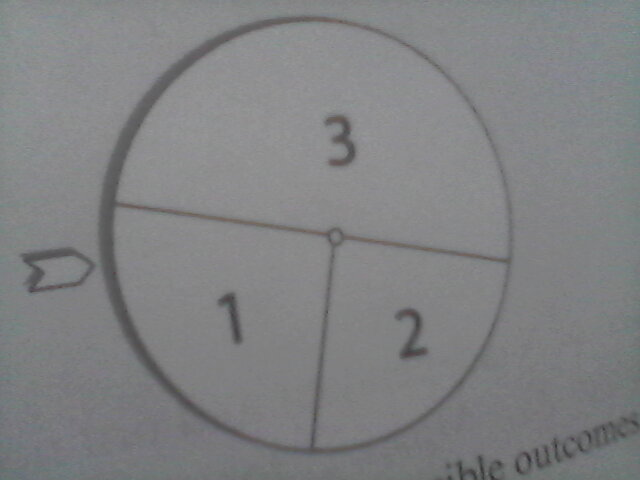

# Chapter 2
## 2.1
Consider a simplified version of the wheel of fortune as seen in the figure. Consider that the wheel is fair. Create a complete probability space as a model for one turn of the wheel

### Solution
A probability space needs a sample space $\Omega$, a $\sigma$-algebra $\mathcal{F}$ and the probability measure $P$.
Here we have 
$$
\Omega = {1,2,3},
$$
$$
\mathcal{F}={\emptyset, {1}, {2}, {3}, {1, 2}, {1,3}, {2,3}, \Omega}
$$
$$
P(\{\omega\})=\begin{cases}
\frac{1}{4} & \text{for } \omega \in \{1,2\} \\
\frac{1}{2} & \text{for } \omega = 3
\end{cases}
$$

## 2.2
Calculate the natural filtration from exercise 2.1, generated by the outcome $A=\{2\}$. Does $\mathcal{F}_1 = 2^\Omega$ hold?

Before any turns the $\sigma$-algebra is
$$
\mathcal{F} = \{\emptyset, \Omega\}
$$

after the outcome $A=\{2\}$ it is
$$
\mathcal{F}_1 = \{\emptyset, \{2\}, \{1, 3\} \Omega\}
$$

Does $\mathcal{F}_1 = 2^\Omega$ hold? The generated $\mathcal{F}_1$ is a subset of the power set. $\mathcal{F}_1 = 2^\Omega$ is the smallest $\sigma$-algebra contaning the outcome.

## 2.3
Consider rolling a fair die with $X(\omega)$ as the number of pips and the event $A$ of throwing an even number. Show that the conditional expectation, given $A$ is greater than the unconditional expectation.

Unconditional probability measure
$$
P(\omega)=\frac{1}{6}
$$
The expectation value is given
$$
E[X] = \sum_{n=1}^6 \frac{1}{6} = \frac{21}{6} = 3.5  
$$

For the conditional probability given $A$
$$
E[X]_A = \sum_{n=1}^6 n P(X=n \mid A)=\sum_{n=1}^{6} n \frac{P(X\cap A)}{P(A)}
$$
where
$$
\frac{P(X\cap A)}{P(A)} = \begin{cases}
\frac{1}{3} & \text{for n even} \\
0 & \text{for n odd}
\end{cases}
$$
using this probability measure to get
$$
E[X]_A = \sum_{n=1}^3 \frac{2n}{3} + \sum_{n=1}^{3}(2n-1)\cdot 0 = \frac{12}{3}=4
$$

## 2.4
Considering the die example of exercise 2.3. Show that the property
$$
E[X]=E[E[X\mid A]]
$$
holds for $A$ being the event of throwing an even number.

$$
E[E[X\mid A]] = E[X\mid A] P(A) + E[X\mid A^C] P(A^C) = 4 \frac{1}{2} + 3 \frac{1}{2}=\frac{7}{2}=3.5
$$

## 2.5
A theorem by Kolmogorov states  that every stochastic process $X(t)$ which satisfies the inequality 
$$
E[\lvert X(t) - X(s) \rvert^a] \le c \lvert t-s \rvert^{1+b}
$$
for $t\gt s$ and a particular set of numbers $a$, $b$ and $c$, has almost surely continuous paths. Show that the Wiener process meets this condition. Use the moment structure of normally distributed random variables (2.31) on page 19.

From the definition of the Wiener process i know that the variance between two times is $t-s$. Considering the moment structure in (2.31) we see that
$$M_2=\lvert t-s \lvert$$ 
which match Kolmogorov for $a=2$, $b=0$ and $c=1$

## 2.6
Assume $N\sim \text{Poi}(\lambda)$ is a Poisson-distributed random variable with probability mass function 
$$
f(n)=e^{-\lambda}\frac{\lambda^n}{n!}
$$
for $n\in \mathbb{N}_0$. Consider a random variable $X$, with
$$
X=\sum_{n=0}^N X_n
$$
where $X_n$ are independent an identically distributed random variables. Prove that the relation 
$$
\varphi(u)=\text{exp}[\lambda(\varphi_n(u)-1)]
$$
holds for the characteristic of $X$ and $X_n$. Use the one to one correspondence of conditional probability and conditional distribution functions.

Notice that it is the sum limit $N$ that is passion distributed.
Let $g(x)$ be an unknown probability density function of $X$ conditioned on $N$
$$
 g(x) = \sum_{N=0}^\infty E[X\mid N]f(N)
$$
For the conditional characteristic function of $X$ following has to hold
$$
E[e^{iuX}\mid N]=\varphi(u)_n^N
$$
as $X_n$ are independent and identically distributed. Putting it together 
$$
\varphi(u) = E[e^{iuX}] = \sum_{N=0}^\infty E[e^{iuX}\mid N]f(N)=\sum_{N=0}^\infty \varphi(u)_n^N e^{-\lambda} \frac{\lambda^N}{N!}=\sum_{N=0}^\infty e^{-\lambda} \frac{\left( \varphi(u)_n \lambda \right)^N}{N!}=e^{(\varphi(u)_n-1)\lambda}
$$

> In this exercise, the characteristic function of the random variable $X$ which is the sum of a Poisson-distributed number of independent and identically distributed (i.i.d.) random variables, was found.

> **Why is This Important?**
This result is useful in probability theory and stochastic processes because it gives a compact way to understand the distribution of sums of random variables when the number of terms is random and Poisson-distributed.
The form of the characteristic function allows for us to find key properties such as moments (mean, variance, etc.).

# Chapter 3
## 3.1
Consider the hyperbolic coordinate transformation
$$
a_1 = \rho \cosh(\phi) \newline
a_2 = \rho \sinh(\phi)
$$
limited to the coordinate wedge $a_1>0$ and $-a_1 <a_2 < a_1$, see Figure 3.13. How does the operation of scaling a vector affect the hyperbolic radius $\rho$ and hyperbolic angle $\phi$. Use the fact that $\cosh^2(\phi)-\sinh^2(\phi) = 1$ holds.

**Solution**  
Assume we have the vector
$$
A = \begin{pmatrix}a_1 \\ a_2 \end{pmatrix}
$$
scaling this vector as $s A = B$
$$
B = \begin{pmatrix}s \rho \cosh(\phi) \\ s \rho \sinh(\phi) \end{pmatrix}
$$
from this we see that it is only the hyperbolic angle that gets scaled. We can express $A$ in terms of the hyperbolic radius and angle using. Using the hint to write 
$$
\rho^2 \left( \cosh^2(\phi) - \sinh^2(\phi) \right) = a_1^2-a_2^2
$$
from which
$$
\rho = \sqrt{a_1^2 - a_2^2}
$$
and the hyperbolic angle
$$
\phi = \text{atanh}\left(\frac{a_2}{a_1}\right)
$$
from which we can write
$$
A' = \begin{pmatrix} \rho  \\ \phi \end{pmatrix}
$$
i.e. a scaling of $A \rightarrow sA$ gives a scaling of 
$$A'\rightarrow \begin{pmatrix} s\rho  \\ \phi \end{pmatrix}$$ 

## 3.2
The outer product is defined as ... . Show that the sum of outer products over a complete set of orthonormal basis vectors is the identity operator
$$
\sum_{n=1}^\N \ket{e_n}\bra{e_n} = I
$$
**Solution**  
From the definition of the outer product and the basis vectors $\ket{e_n}\bra{e_n}$ is a $N \times  N$ matrix with the only non zero entry being the $n$'th diagonal element. Summing up all these gives the identity.

Alternatively, considering $\ket{a}$ we can
$$
\sum_{n=1}^\N \ket{e_n}\bra{e_n} \ket{a} = \sum_{n=1}^\N \ket{e_n}a_1 
$$
i.e if $\ket{a}$ was already expressed in terms of the $\ket{e_n}$ this operation does nothing.

## 3.3
Show that the outer product $\ket{e_k}\bra{e_n}$ for $k, n=1, 2$ form a complete basis of the vector space $\mathbb{R}^{2\times 2}$

**Solution**  
> Remember that forming a complete basis means that the entire vector space can be spanned by a linear combination of the basis parts.

$\ket{e_k}\bra{e_n}$ forms the four matrices
$$
\ket{e_0}\bra{e_0} =  \begin{pmatrix} 1 & 0  \\ 0 & 0 \end{pmatrix}
$$ 
$$
\ket{e_1}\bra{e_0} =  \begin{pmatrix} 0 & 0  \\ 1 & 0 \end{pmatrix}
$$ 
$$
\ket{e_0}\bra{e_1} =  \begin{pmatrix} 0 & 1  \\ 0 & 0 \end{pmatrix}
$$ 
$$
\ket{e_1}\bra{e_1} =  \begin{pmatrix} 0 & 0  \\ 0 & 1 \end{pmatrix}
$$ 
these are obviously independent. Considering these it follows directly.

## 3.4
Consider the complex space of periodic functions in the interval $[0, 2\pi]$. Show that the exponential Fourier-functions 
$$
\ket{\psi_n} = \frac{1}{\sqrt{2\pi}}e^{inx}
$$
for $n\in\mathbb{Z}$, form an orthonormal basis.
**Solution**

To form an orthonormal basis I have to show that the inner product $\braket{\psi_n|\psi_m }$ is $1$ for $n=m$ and $0$ for $n\ne m$.
For $n+m\ne 0$ it follows
$$
\braket{\psi_n|\psi_m } = \int_0^{2\pi}\frac{1}{2\pi}e^{i(m-n)x}\text{d}x 
$$
and for $n-m= 0$
$$
\braket{\psi_n|\psi_m } = 1
$$

**Solution**

For  $n\ne m$
$$
\braket{\psi_n|\psi_m } = \frac{1}{2\pi}\int_ 0^{2\pi} \left( \cos((m-n)x)+i \sin((m-n)x)\right) \text{d}x=0
$$
As both cos and sine are periodic with a period of $2\pi$ and $m-n$ is an integer 

For $n=m$
$$
\braket{\psi_n|\psi_m } = \frac{1}{2\pi}\int_ 0^{2\pi} \text{d}x=1
$$

## 3.5
The trace of a square matrix is a linear functional, defined as the sum of its rincipal diagonal elements, 
$$
\text{tr}[M]=\sum_{n=1}^{N}m_{nn}
$$
A further property of the trace is $\text{tr}[AB]=\text{tr}[BA]$ for suitable matrices $A$ and $B$. Show that for a square matrix $M$ the following property holds 
$$
\text{tr}[M]=\sum_{n}^{N} \lambda_n
$$
which means that the trace os also equal to the sum of eigenvalues.

**Solution**

$$
\text{tr}[M]=\text{tr}[V\Lambda V^T]=\text{tr}[V^TV\Lambda]=\text{tr}[\Lambda]
$$
where i have done an eigenvalue decomposition into the eigen vectors and eigenvalues.

## 3.6
The matrix exponential of a square matrix $M$ is defined in terms of its taylor series 
$$
e^{M}=\sum_{k=0}^\infty \frac{M^k}{k!}
$$
prove that an alternative representation is
$$
    e^M=V e^{\Lambda} V^{-1} \ \ \text{with} \ \ e^{\Lambda}= \begin{pmatrix}
e^{\lambda_1} & \cdots & 0 \\
\vdots & \ddots & \vdots \\
0 & \cdots & e^{\lambda_n}
\end{pmatrix}
$$

**Solution**
$$
    e^{V\Lambda V^{-1}}= \sum_{k=0}^\infty \frac{(V\Lambda V^{-1})^k}{k!}=V \left(\sum_{k=0}^\infty \frac{\Lambda^k}{k!} \right) V^{-1}
$$
which is the desired result.

## 3.7
**Solution**
variation according to $\bra{\beta}$
$$
0=\frac{\text{d}}{\text{d}\bra{\beta}}\braket{\epsilon,\epsilon}=\frac{\text{d}}{\text{d}\bra{\beta}} \left(\bra{\beta}X'-\bra{y}\right)\left(X\ket{\beta}-\ket{y}\right)
$$
$$
0= 2X'X\ket{\beta}-2X'\ket{y}
$$

## 3.8
Take the two-dimensional random vector $\ket{X}$ to be normally distributed with covariance matrix
$$
\Sigma =  \begin{pmatrix}
\sigma_1^2 &  \sigma_{12} \\
\sigma_{21} & \sigma_2^2
\end{pmatrix}
$$

What is the variance of $Y=\braket{1, X}$ with $\bra{1}=(1,1)$ and what does this correspond to?

**Solution**

$$
\text{Var}(Y)=\text{Var}(x_1 + x_2)=\text{Var}(x_1) + \text{Var}(x_2) +2\text{Cov}(x_1, x_2)=\sigma_1^2 + \sigma_2^2 +2\sigma_{12}
$$
i.e. the sum of two random variables that might have correlation.

# Chapter 4: Utility Theory

## 4.1
Find the expectation value of the St. Petersburg paradox
**Solution**

The expected value van be written
$$
V = \sum_{n=0}^\infty 2^{n} p_n = \sum_{n=0}^\infty 2^n\frac{1}{2^{n+1}} = \frac{1}{2}\sum_{n=0}^\infty 1
$$

## 4.2
Daniel Bernoulli suggested expected utility to solve the St. Petersburg paradox. He used a logarithm utility 
$$
u(w)=ln(w)
$$
show that the expected utility os St. Petersburg is finitie with wealth equivalent $w^*=2$

**Solution**
$$
E[u(W)] = \sum_{n=0}^\infty u(2^n) \frac{1}{2^{n+1}} =\frac{1}{2}\sum_{n=0}^\infty \ln(2^n) 2^{-n}=\frac{1}{2}\ln(2)\sum_{n=0}^\infty n 2^{-n}=\ln(2)
$$
From which we can read off the certainty equivalent wealth to be $w^*=2$

## 4.3
Suppose you own wealth $w$ and you are facing a potential loss $l$ with probability $p$. An insurance company is willing to ensure an arbitary loss $\eta$ for $\eta p$. Assuming you are risk averse, what amount $\eta^*$ would you ensure under expected utility maximization.

**Solution**

The expected wealth is
$$
E[W] = (w-l+\eta-\eta p)p + (w - \eta p)p
$$
the expected utility is
$$
E[u(W)] = u(w-l+\eta-\eta p)p + u(w - \eta p)(p-1).
$$
Differentiating with respect to $\eta$ and equating to zero
$$
0=(1-p)pu'(w-l+\eta-\eta p) -p(p-1) u'(w-\eta p)
$$
$$
u'(w-\eta p)=u'(w-l+\eta-\eta p) \newline
w-\eta p=w-l+\eta-\eta p \newline
\eta = l.
$$
Optimally you should ensure $\eta^* = l$.

## 4.4
For the special class of utility functions $u(w)=w-be^{-aw}$ with $a,b \gt 0$ the expected utility takes the form
$$
\begin{align*}
    E[u(W)] &= E[W] - b E[e^{-aw}] \newline
    &= E[W] - b e^{-aE[W]}\cdot  E[e^{-a(W-E[W])}].
\end{align*}
$$
Show that $E[e^{-a(W-E[W])}]$ does not only take the variance into account but all higher central moments.
**Solution**
$$
E[e^{-a(W-E[W])}]=\int_{-\infty}^\infty e^{-a(w-\mu)} \rho(w) \text{d}w
$$
Taylor expanding the exponential
$$
=\int_{-\infty}^\infty \left(\sum_{n=0}^\infty \frac{(-a(w-\mu))^n}{n!}\right) \rho(w) \text{d}w = \sum_{n=0}^\infty \frac{(-a^n)}{n!}\int_{-\infty}^\infty (w-\mu)^n \rho(w) \text{d}w = \sum_{n=0}^\infty \frac{(-a^n)}{n!} M_k
$$

The integral is the definition of the centralized moment of order n.

## 4.5

Show that hyperbolic absolute risk aversion with $\beta=0$ in the limit $\gamma \to 1$ specializes to Bernoulli's logarithmic utility.

