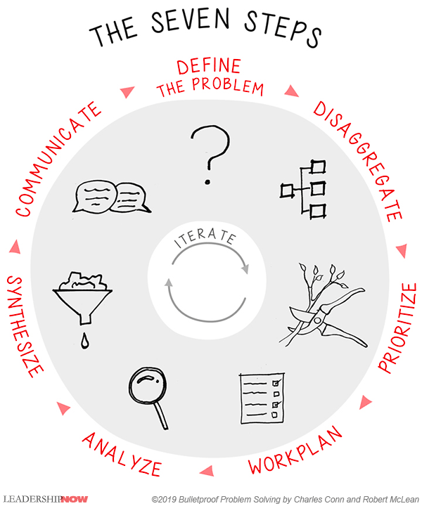

Problem solving is one, if not the most, sought skill but it is never taught.

# Chapter One: Learning the Bulletproof Problem Solving Approach
Always have a coherent summary of the problem and a solution path at any point in the project, not just the end. The process of creating active hypothesis is as the heart of the bulletproof problem solving approach.

When tackeling problems alone it is suggested to include review processes with family and colleagues.

> **1. Define the Problem** - When the problem context and boundaries are not fully described there is a lot of room for errors. First step is to arrive at a problem definition that all agree upon.

> **2. Disaggregate the Issues** - A problem should be broken down into component parts or issues. employ logic trees of various to elegantly disassemble problems into parts. It is normal to try this several times.

> **3. Prioritize the Issues, Prune the Tree** - Identify which branches of the logic tree has the biggest impact, including those you can most affect, and focus the initial attention on these.

> **4. Build a Workplan and Timetable** - Link each part of the problem to a plan for fact gathering and analysis. Workplan and timetable assigns team members to alalytic tasks with specific outputs and completion dates.

> **5. Conduct Critical Analysis** - For speed and simplicity start with heuristics to get an order of magnitude understanding of each component.

> **6. Synthesize findings from the Analysis** - Problem solving does not stop when a solution has been found to each component but when they have been assempled into a logical structure to test validity and synthesized in a way the convinces others that a good solution has been found.

> **7. Prepare a Powerful Communication** - Develop a storyline from the conclusions that links back to the problem statement and the issues that were defined.

